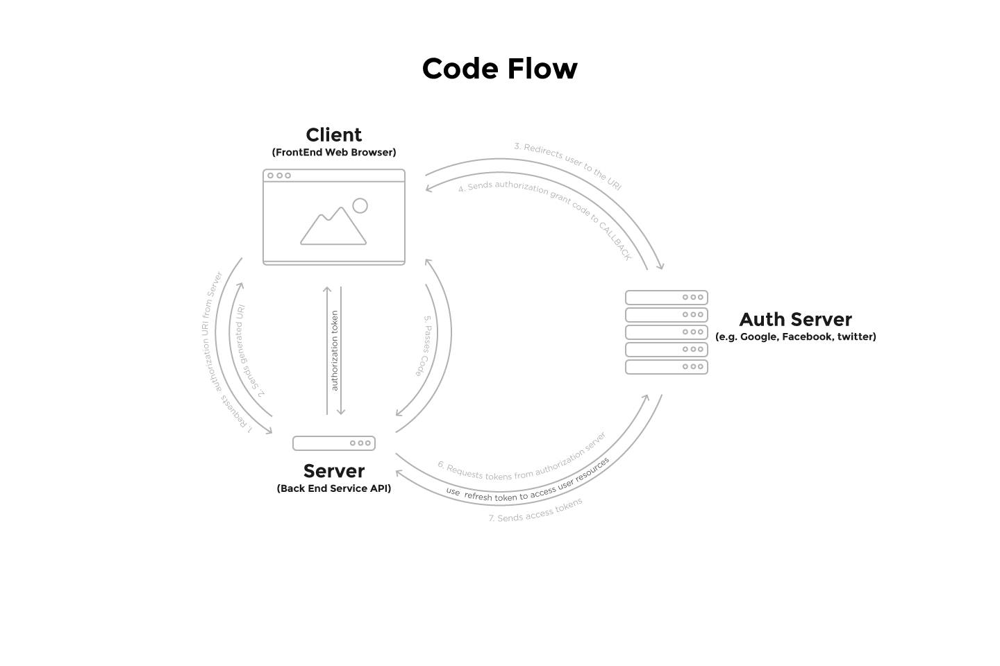

# OAuth

Resouces:
- [DigitalOcean - An Introduction to OAuth 2](https://www.digitalocean.com/community/tutorials/an-introduction-to-oauth-2)
- [StackOverFlow - How OAuth 2.0 works in real life](http://stackoverflow.com/questions/4727226/on-a-high-level-how-does-oauth-2-work)
- [Google -
Using OAuth 2.0 for Web Server Applications](https://developers.google.com/identity/protocols/OAuth2WebServer)

## OAuth2
*Open Authorization* is a framework for authorization through `tokens` which grants **Applications** access to **Users** resources.

## Code Flow


Before hand register your application with an `Authorization Server` and setup this variables in your environment.

```
GOOGLE_CLIENT_ID=123456789.apps.googleusercontent.com
GOOGLE_CLIENT_SECRET=a1B2c3D4E5f6g7h8
GOOGLE_CLIENT_REDIRECT_URI=http://coolwebapp.com/oauth2callback
```



### User wants to Sign in / up


```
User - Hey App can I use you?
FrontEnd - Sure, but I need of your google resources profile info.
User - I'm not giving you my google password ...
FrontEnd -
```

##### 1. FrontEnd Requests Authorization URI from Server

You could optionally have this `URI` in your **FrontEnd** but having your **Server** generate a unique state that you can later check adds a extra layer of security.

##### 2. Server sends generated URI
```
FrontEnd - Hey Server can you generate a `URI` for this user to authorize google profile access?
Server - Sure thing.
```

FrontEnd redirects uses or makes a `popup` to the `URI`
```
FrontEnd - Hey User go to this URI and let google know I can use them.
```

##### 3. User is redirected to the URI
The `URI` will let the **Authorization Server** know who needs the resources, what resources it needs and where to send it to.

```sh
# hey google Authorization Server
https://accounts.google.com/o/oauth2/v2/auth?
  # it's CoolWebApp
  client_id=GOOGLE_CLIENT_ID&
  # I need an authorization code
  response_type=code&
  # to access these resources
  scope=email profile&
  # even when the user is away (optional)
  access_type=offline&
  # when they've consent to it send a grant code to here
  redirect_uri=GOOGLE_CLIENT_REDIRECT_URI&
  # also to make sure it came from me pass me this state back (optional)
  state=i9j10K11l12M13
```

User grants permission
```
User - Hey Facebook, give App what it asked for.
Facebook - Sure User, just sign this consent form.
```

##### 4. Sends authorization grant code to CALLBACK

```sh
POST
  # hey CoolWebApp
  http://coolwebapp.com/oauth2callback?
    # here's a access grant code
    code=n14O15p16q17r18&
    # and the state you passed before (optional)
    state=i9j10K11l12M13
```

##### 5. Passes code and state to Server
This is optional you can have your callback either on the FrontEnd on BackEnd, I find it easier to have the FrontEnd wait on the promise at this point.

```
FrontEnd - Got it. Hey Server use this access tokens.
Server - Sure
```

##### 6. Server Requests tokens from Authorization Server

```
FrontEnd - Got it. Hey Server use this access tokens.
Server - Sure, let me talk to Google again.
```

```sh
POST
Content-Type: application/x-www-form-urlencoded
  # hello again google
  https://googleapis.com/oauth2/v4/token
    # it's CoolWebApp
    client_id=GOOGLE_CLIENT_ID&
    # it's really me and not someone else
    client_secret=GOOGLE_CLIENT_SECRET&
    redirect_uri=GOOGLE_CLIENT_REDIRECT_URI&
    # A user has granted authorization to their resources
    grant_type=authorization_code
    # here's the access code
    code=n14O15p16q17r18&
```

##### 7. Authorization Server responds with Access Tokens
There's various options for here forwards. Use the `refresh_token` to fetch the user profile, use `id_token` for authentication between the FrontEnd and Server, use `id_token.email` to find a user the database. it's up to you.

```
Google - All checks ok, here's the access tokens for the user.
Server - Thanks
```

tokens
```js
{
  token_type: "Bearer",
  // use to fetch user resources
  access_token: "s19T20u21v22w23...",
  // contains the user identification
  id_token: "x24Y25z26a1B2...",
  // if requested offline access, save it for later use.
  refresh_token: "C3d4E5f6g7...",
  expiry_date: 1466029737619
}
```

decoded `id_token`
```json
{
  "iss": "accounts.google.com",
  "at_hash": "h8i9J10k11l12",
  "aud": "GOOGLE_CLIENT_ID",
  "sub": "USER_ID",
  "email_verified": true,
  "azp": "GOOGLE_CLIENT_ID",
  "email": "useremail@mail.com",
  "iat": 1466026137,
  "exp": 1466029737
}
```

User profile can be fetched now using the `access_token`
```sh
GET
# I have an access_token just let me through
Authorization: Bearer s19T20u21v22w23...
  https://googleapis.com/plus/v1/people/me/openIdConnect
```


##### 8. Server responds with Authorization token

```
Server - FrontEnd we know who the user is now.
Server - Save this token your memory so we can talk securely
FrontEnd - Great, Welcome in User.
```
