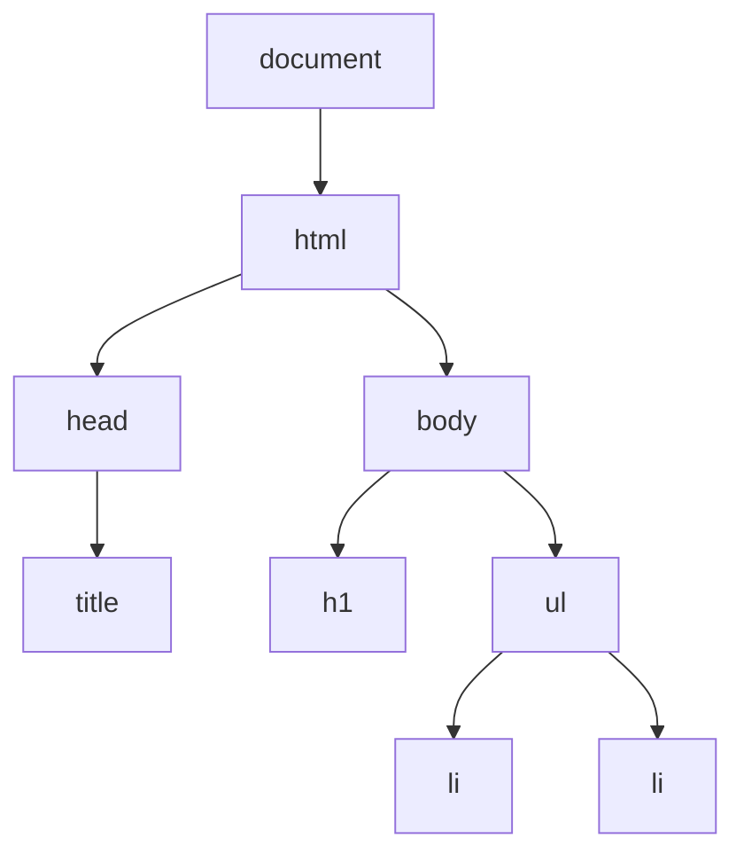

# Browser - DOM

When the browser reads your HTML, it builds a live tree of objects called the **DOM** (Document Object Model). JavaScript can't touch your HTML file, but it can touch this tree: find elements, change them, add new ones and react when the user clicks or types. This is how every interactive page works, and it's still worth knowing even if you mostly use React, because React is changing the DOM for you under the hood.

## window and document

`window` is the browser tab. It is the global object, so anything global lives on it.

```js
window.innerWidth // 1280 (the viewport width in pixels)
window.location.href // 'https://example.com/menu'
alert('Hi') // same as window.alert('Hi')
```

`document` is the page inside that tab, and the root of the DOM tree.

```js
document.title // "Ana's Coffee Shop"
document.body // <body>…</body>
```

## The tree

Every element is a **node** in the tree, with a parent, children and siblings. Text inside elements is a node too.



Most of DOM work is three things:

1. **Select**: find the element you want.
2. **Change**: its text, classes, attributes, or the tree itself.
3. **Listen**: run code when something happens (an event).

## Selecting elements

`querySelector` takes any CSS selector and returns the first match, or `null`. `querySelectorAll` returns all matches.

```js
const title = document.querySelector('h1')
const order = document.querySelector('#order')
const checkboxes = document.querySelectorAll('input[type="checkbox"]')

checkboxes.length // 3
checkboxes.forEach((box) => console.log(box.value))
```

If you know CSS selectors, you already know how to select in JavaScript. The older `getElementById` and `getElementsByTagName` still work, but `querySelector` covers both.

### querySelectorAll vs getElementsBy…

| | `querySelectorAll` | `getElementsByTagName` / `ClassName` |
|---|---|---|
| Returns | `NodeList` | `HTMLCollection` |
| Live? | ❌ a snapshot | ✅ updates when the DOM changes |
| `forEach` | ✅ | ❌ (use `Array.from` first) |

A snapshot is usually what you want: it won't change while you loop over it.

## Changing text and classes

```js
const price = document.querySelector('.price')

price.textContent // '€3.50'
price.textContent = '€3.80'
```

`textContent` sets plain text. `innerHTML` reads and writes HTML, which is powerful but dangerous.

```js
// ❌ if name comes from a user, they can inject their own HTML and scripts
greeting.innerHTML = `Hi ${name}`
// ✅ text is always treated as text
greeting.textContent = `Hi ${name}`
```

For styling, change classes, not inline styles. `classList` keeps the other classes untouched.

```js
const card = document.querySelector('.card')

card.classList.add('is-selected')
card.classList.remove('is-selected')
card.classList.toggle('is-open') // adds if missing, removes if there
card.classList.contains('is-open') // true
```

Attributes and form values work the same way:

```js
const link = document.querySelector('a')
link.getAttribute('href') // '/menu'
link.setAttribute('href', '/menu/autumn')

const input = document.querySelector('#name')
input.value // 'Ana'

const box = document.querySelector('#oat')
box.checked // true
```

`data-` attributes are handy for storing small bits of info on an element. Read them with `dataset`.

```js
// <li data-drink="latte">Latte</li>
item.dataset.drink // 'latte'
```

## Moving around the tree

From any element you can walk to its relatives.

```js
const item = document.querySelector('li')

item.parentElement // <ul>
item.nextElementSibling // the next <li>
item.closest('.menu') // nearest ancestor matching the selector, or null

const list = document.querySelector('ul')
list.children // HTMLCollection of <li>
list.firstElementChild // the first <li>
```

`closest` is the most useful of these. You'll see it again with event delegation below.

## Creating and removing elements

```js
const list = document.querySelector('#orders')

const item = document.createElement('li')
item.textContent = 'Latte for Ana'
list.append(item) // adds at the end

list.prepend(item) // moves it to the start
item.remove() // gone
```

`append`, `prepend`, `before`, `after` and `remove` are the modern versions of `appendChild` and `removeChild`, and they read better.

## Events

`addEventListener` runs a function when something happens. The browser passes it an `event` object with the details.

```js
const button = document.querySelector('#order-button')

button.addEventListener('click', (event) => {
  console.log('Ordered!', event.target) // the element that was clicked
})
```

Pass the function, don't call it.

```js
// ❌ runs sayHello right now, and passes its result
button.addEventListener('click', sayHello())
// ✅ passes the function, to run on each click
button.addEventListener('click', sayHello)
```

Common events: `click`, `input` (every keystroke in a field), `change`, `submit`, `keydown`, `DOMContentLoaded`. The full list is on MDN.

### addEventListener vs onclick

`button.onclick = sayHello` and `<button onclick="sayHello()">` also work, but each element can only hold one `onclick`, and the inline version mixes JavaScript into HTML. Use `addEventListener`: it allows many listeners and can be removed with `removeEventListener`.

### Stopping the default

Some events have a built-in behaviour: a link navigates, a form submits and reloads. `preventDefault()` stops it.

```js
form.addEventListener('submit', (event) => {
  event.preventDefault()
  // handle the order ourselves
})
```

## Event delegation

Events **bubble**: a click on an `<li>` also fires on its `<ul>`, the `<body>` and up to `document`. So instead of adding a listener to every item, add one to the parent.

```js
const menu = document.querySelector('.menu')

menu.addEventListener('click', (event) => {
  const item = event.target.closest('li')
  if (!item) return
  console.log(`You picked ${item.dataset.drink}`) // 'You picked latte'
})
```

This one listener also works for items you add later.

## Common mistakes

- Selecting an element before it exists. Load scripts with `defer` (see [[docs/html/html|HTML - Basics]]) so the HTML is parsed first.
- Forgetting that `querySelector` returns `null` when nothing matches, then calling a method on it.
- Using `innerHTML` with user input.
- Calling the handler (`sayHello()`) instead of passing it (`sayHello`).

## Try it

1. Make a button that toggles a `dark` class on `<body>`.
2. Build a small order list: a text input, an "Add" button, and new `<li>` items appended on click.
3. Use event delegation so clicking any item removes it.

## Related

- [[docs/javascript/javascript|JavaScript - Basics]]
- [[docs/javascript/javascript-functions|JavaScript - Functions]]
- [[docs/html/html-forms|HTML - Forms]]
- [[docs/browser/browser-storage|Browser - Storage]]
- [[docs/browser/browser-geolocation|Browser - Geolocation]]
