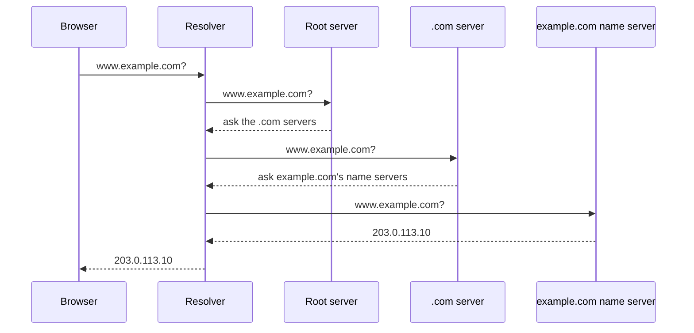

# Networking - DNS

DNS (Domain Name System) is the internet's phone book. You type `example.com`; computers need an IP address like `203.0.113.10`. DNS turns one into the other. You'll touch it every time you buy a domain, point it at a server, set up email or verify a domain for a service, and when it's wrong, nothing else works.

## Anatomy of a domain name

Read a domain from right to left, from most general to most specific.

```
www.example.com.
 │     │     │  └ root (the trailing dot, usually hidden)
 │     │     └ top-level domain (TLD): .com, .org, .uk
 │     └ domain: the part you buy
 └ subdomain: anything you add in front
```

A few rules:

- Letters, digits and hyphens only. A label can't start or end with a hyphen.
- Each label is at most 63 characters; the whole name at most 253.
- TLDs are either country codes (`.uk`, `.pt`) or generic (`.com`, `.org`, `.dev`).

## How a lookup works

When your browser needs `www.example.com`, it asks a **resolver** (run by your ISP, your router, or a public one). If the resolver doesn't have the answer cached, it walks down the tree.



- **Root servers** know where every TLD lives. The root zone is managed by IANA, part of ICANN, and the root servers are run by a group of organisations.
- **TLD servers** know which name servers are in charge of each domain.
- **Authoritative name servers** hold your actual records. Whoever hosts your DNS runs these.

Ask DNS yourself with `dig`:

```sh
dig +short example.com
# 203.0.113.10
```

## TTL and propagation

Every record has a **TTL** (time to live) in seconds: how long resolvers may cache the answer.

```
example.com.  3600  IN  A  203.0.113.10
# cache this for 3600 seconds (1 hour)
```

"DNS propagation" is just caches expiring around the world. Rule of thumb: before you move a site, lower the TTL to a few minutes a day ahead, make the switch, then raise it again.

## Records you'll actually use

| Record | Points a name to | Example |
|---|---|---|
| `A` | An IPv4 address | `example.com → 203.0.113.10` |
| `AAAA` | An IPv6 address | `example.com → 2001:db8::10` |
| `CNAME` | Another name (an alias) | `www.example.com → example.com` |
| `MX` | The mail servers for the domain | `10 mail.example.com` |
| `TXT` | Free text, mostly verification and email rules | `v=spf1 ...` |
| `NS` | The name servers in charge of the domain | `ns1.dnshost.example` |

### A and AAAA

The everyday record: this name lives at this address. `AAAA` is the same thing for IPv6. A **wildcard** like `*.example.com` matches any subdomain without its own record.

### CNAME

An alias: "this name is the same as that name". Handy when a service gives you a hostname instead of an IP.

```
shop.example.com.  CNAME  shops.myshopprovider.example.
```

When their IP changes, you don't have to do anything. Gotcha: you can't put a `CNAME` on the bare domain (`example.com` itself). Many DNS hosts offer an `ALIAS` or "CNAME flattening" record for that case.

### MX

Where email for the domain should go. Lower number means higher priority; the others are backups.

```
example.com.  MX  10  mail1.example.com.
example.com.  MX  20  mail2.example.com.
```

### TXT

Free-form text. Services ask you to add a `TXT` record to prove you own a domain, and email uses `TXT` records for SPF, DKIM and DMARC. That's covered in [[docs/smtp|Networking - Email]].

## Reverse DNS

Normal DNS goes from name to IP. **Reverse DNS** goes from IP to name, using a `PTR` record. The IP is written backwards under `in-addr.arpa`:

```
10.113.0.203.in-addr.arpa.  PTR  mail.example.com.
```

You'll rarely set one, except for a mail server: receiving servers check that the sending IP's `PTR` matches its name. The `PTR` is set by whoever owns the IP (your hosting provider), not in your DNS zone.

## Where to host your DNS

| Option | Good | Not so good |
|---|---|---|
| Your registrar | ✅ Free, already there | ⚠️ Often basic |
| A DNS provider or CDN | ✅ Fast, good tools, survives a registrar move | Another account to manage |
| Run your own name server | Full control | ❌ Two servers to keep alive for no real gain |

✓ My pick: a dedicated DNS provider or your CDN. Pay for a managed service rather than babysit a name server.

## Common mistakes

- **Forgetting the trailing dot** in zone files. `mail.example.com` without the dot can become `mail.example.com.example.com.`
- **A `CNAME` next to other records** on the same name. A name with a `CNAME` can't have anything else.
- **Changing records with a long TTL** and wondering why half the world still sees the old site.
- **Testing with your browser.** It caches. Use `dig` to see what DNS really says.

## Try it

1. Run `dig example.com A`, `dig example.com MX` and `dig example.com TXT` for a domain you use. What do the answers tell you?
2. Run `dig +trace example.com` and match each step to the lookup diagram above.
3. Write the records for a new site: `example.com` and `www.example.com` on one server, email handled by a provider.

## Related

- [[docs/networking|Networking - Basics]]
- [[docs/http|Networking - HTTP]]
- [[docs/smtp|Networking - Email]]
- [[docs/ssl|Networking - HTTPS and TLS]]
- [[docs/nginx|DevOps - Nginx]]
- [[docs/server-setup|DevOps - Server Setup]]
