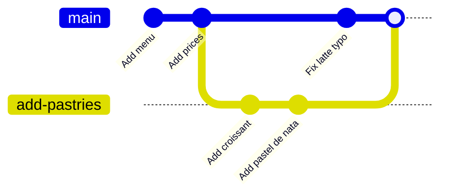

# Git - Branching

A branch is a separate line of work. You can try out a new feature on its own branch while `main` stays clean and working, then bring the work back in with a merge when it's ready. Branches in Git are cheap and fast, which is a big part of why Git took over.

## Branches are pointers

A branch is not a copy of your files. It is a small label that points at one commit. When you commit on a branch, the label moves forward to the new commit. `HEAD` points at the branch you are on.



Here `main` and `add-pastries` share history up to "Add prices", grow apart, and the merge at the end joins them again.

## Listing, creating and switching

```sh
git branch                    # list local branches, * marks the current one
# * main

git switch -c add-pastries    # create a branch here and switch to it
git switch main               # switch back
git branch -a                 # include branches from remotes too
```

`git switch -c` is the everyday command. In older guides you will see `git checkout -b add-pastries`, which does the same thing.

Switching changes the files in your working tree to match that branch's latest commit. Commit (or stash) your work before switching so nothing gets mixed up.

## Merging

To bring a branch's work into another, switch to the branch that should receive it and merge.

```sh
git switch main
git merge add-pastries
```

Git does one of two things.

| Situation | What Git does | Result |
| --- | --- | --- |
| `main` hasn't moved since you branched | **Fast-forward**: slides the `main` pointer up to the branch | Straight line of history, no new commit |
| Both branches have new commits | **Merge commit**: a new commit with two parents | History shows the branch and where it joined |

When the work is merged, delete the branch label. The commits stay in history.

```sh
git branch -d add-pastries    # refuses if the branch isn't merged yet
git branch -D add-pastries    # force: deletes even unmerged work
```

## Merge conflicts

If both branches changed the same lines, Git can't choose for you. It stops and marks the file.

```sh
git merge new-greeting
# CONFLICT (content): Merge conflict in welcome.txt
# Automatic merge failed; fix conflicts and then commit the result.
```

```text
<<<<<<< HEAD
What's up!
=======
Good day!
>>>>>>> new-greeting
```

The top half is your current branch (`HEAD`), the bottom half is the branch you are merging in. Edit the file into what it should be and delete the markers:

```text
Good day, what's up!
```

Then tell Git it's resolved by staging the file, and finish the merge:

```sh
git add welcome.txt
git commit        # Git writes the "Merge branch 'new-greeting'" message for you
```

Changed your mind halfway? `git merge --abort` puts everything back as it was before the merge.

## Stashing unfinished work

Sometimes you are halfway through something and need to switch branches, say to fix an urgent bug on `main`. The work isn't ready to commit. `git stash` puts your uncommitted changes on a shelf and gives you a clean working tree.

```sh
git stash                     # shelve changes to tracked files
git stash -u                  # also shelve untracked (new) files
git switch main               # fix the bug, commit, come back
git switch add-pastries
git stash pop                 # bring the changes back and drop the stash
```

`pop` vs `apply`: `pop` restores the changes and removes them from the stash. `apply` restores them but keeps a copy in the stash.

You can stack several stashes:

```sh
git stash list
# stash@{0}: WIP on add-pastries: eefd3cf Add croissant
# stash@{1}: WIP on main: 3f2a1c9 Add menu
git stash apply stash@{1}
```

Started work on the wrong branch? You don't need a stash for that. `git switch -c the-right-branch` carries your uncommitted changes onto the new branch.

## Common mistakes

- **Merging in the wrong direction.** `git merge x` brings `x` into the branch you are on. Check with `git status` before merging.
- **Leaving conflict markers in the file.** Search for `<<<<<<<` before you commit a resolved merge.
- **Using `-D` out of habit.** `-d` protects you from deleting unmerged work. Reach for `-D` only when you mean to throw the work away.
- **Forgetting stashes.** Stashes are easy to lose track of. Run `git stash list` now and then, or prefer a quick work-in-progress commit on your branch.

## Try it

1. Create a branch `add-teas`, commit a line to `menu.txt`, switch to `main` and merge it. Was it a fast-forward?
2. Create two branches from `main` that change the same line of `menu.txt` differently. Merge both into `main` and resolve the conflict.
3. Edit a file, stash it, check `git status` is clean, then `pop` it back.

## Related
- [[docs/git/git|Git - Basics]]
- [[docs/git/git-history|Git - History]]
- [[docs/git/git-remotes|Git - Remotes]]
- [[docs/git/git-flow|Git - Flow]]
