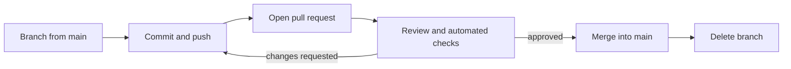
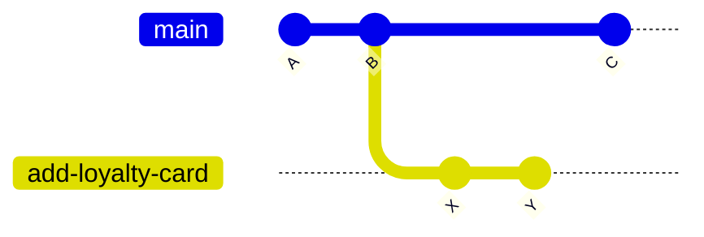
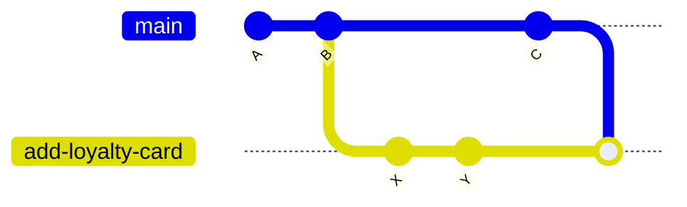
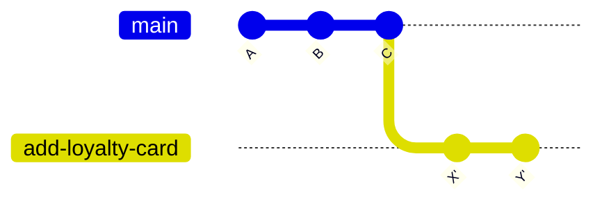

# Git - Flow

A flow is the team's agreement on how work moves from an idea to `main`. Git doesn't enforce one; it gives you branches, merges and remotes, and the team decides how to use them. This lesson covers the flow most teams use today (feature branches and pull requests) and the one choice you'll meet daily: rebase or merge.

## Feature branches

The rule: `main` always works and could be deployed at any moment. Every change, whether a feature, a fix or a refactor, happens on its own short-lived branch.

```sh
git switch main
git pull
git switch -c add-loyalty-card
# ...commit as you go...
git push -u origin add-loyalty-card
```

Short-lived is the important part. A branch that lives for weeks drifts away from `main` and becomes painful to merge.

## Pull requests

A pull request (PR) is a request to merge your branch into `main`, made on the hosting site (GitHub calls it a pull request, GitLab a merge request). It's where the team reviews the change before it lands.



A good PR:

- does one thing, small enough to review in one sitting;
- explains what changed and why in its description;
- passes the automated checks (tests, linting) before anyone reviews it.

Pushing more commits to the branch updates the open PR, so review feedback is just more commits.

## Merge vs rebase

Both bring the changes from one branch into another. They differ in what history looks like afterwards.

Say `main` moved on while you worked on `add-loyalty-card`:



**Merge** joins the two lines with a new merge commit. Nothing is rewritten.

```sh
git switch add-loyalty-card
git merge main
```



**Rebase** replays your commits on top of the latest `main`, as if you had started your branch just now. History becomes one straight line, but `X` and `Y` are rewritten into new commits (`X'`, `Y'`) with new ids.

```sh
git switch add-loyalty-card
git rebase main
```



| | Merge | Rebase |
| --- | --- | --- |
| History | True record, with branch shapes | Straight line, easier to read |
| Rewrites commits | No | Yes, new ids |
| Conflicts | Resolved once, in the merge commit | Possibly once per replayed commit |
| Safe on shared branches | Yes | Only on branches nobody else uses |

The golden rule: **rebase only commits that haven't been shared**, or that only you work on. Rebasing a branch others have pulled rewrites history under them. After rebasing a branch you already pushed, you have to `git push --force-with-lease`.

If a rebase gets messy, `git rebase --abort` puts things back.

## Pulling with rebase

`git pull` merges by default, which leaves small "Merge branch 'main' of ..." commits whenever you and a teammate both committed. Many people prefer to replay their unpushed commits on top instead:

```sh
git pull --rebase
git config --global pull.rebase true   # make it the default
```

This is the safest use of rebase: the commits being replayed are your own, not yet pushed.

## How PRs get merged

Hosting sites usually offer three buttons. Teams pick one and stick to it.

| Option | Result on `main` |
| --- | --- |
| Merge commit | All branch commits, plus a merge commit |
| Squash and merge | The whole branch becomes one commit |
| Rebase and merge | Branch commits replayed in a straight line, no merge commit |

Squash is a popular default: messy work-in-progress commits on the branch don't matter, and `main` gets one clean commit per PR. Writing good commit messages for that is covered in [[docs/commits|Engineering - Commits]].

## Git-flow

Git-flow is an older, heavier model with long-lived `develop` and `main` branches plus `feature/`, `release/` and `hotfix/` branches, and a helper tool (`git flow feature start ...`). It suits software shipped in numbered releases, where several versions are supported at once. For web apps deployed continuously, feature branches and PRs straight into `main` are simpler and are what most teams use now.

## Common mistakes

- **Rebasing a shared branch.** Teammates end up with duplicate commits and confusing conflicts. Merge instead.
- **Plain `--force` after a rebase.** Use `--force-with-lease`, so you don't overwrite commits someone else pushed meanwhile.
- **Huge pull requests.** They get skimmed, not reviewed. Split the work into several small PRs.
- **Branching from a stale `main`.** Pull before you branch.

## Try it

1. Create a branch, make two commits, then add a commit to `main`. Rebase your branch onto `main` and compare `git log --oneline --graph --all` before and after.
2. Repeat the setup, but this time `git merge main` into your branch. Compare the graph with the rebase version.
3. Push a branch to GitHub, open a pull request, push one more commit and watch the PR update.

## Related
- [[docs/git/git-branching|Git - Branching]]
- [[docs/git/git-remotes|Git - Remotes]]
- [[docs/git/git-history|Git - History]]
- [[docs/commits|Engineering - Commits]]
