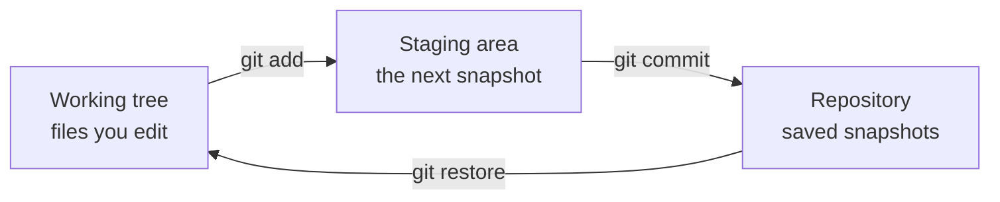

# Git - Basics

Git is a version control system: it remembers every saved version of a project, who made each change and why. Think of it as an unlimited "undo" history for a whole folder, one that several people can share without overwriting each other's work. Linus Torvalds wrote it to manage the Linux kernel, a project with thousands of contributors, and today it is the default for almost every software project.

Resources:
- [Getting Started - About Version Control](https://git-scm.com/book/en/v2/Getting-Started-About-Version-Control)
- [Git](https://git-scm.com/)

## Repositories

A repository (or "repo") is a project folder plus its full history: every version, in order, with a message and an author for each change. Git keeps that history in a hidden `.git` folder at the root of the project.

Git is distributed: there is no single central copy. Everyone who works on the project has the whole history on their own machine. Sites like GitHub host a shared copy so people can swap changes, review them and discuss them, but your local repo works fine offline.

## The mental model

Your work moves through three places. Once this clicks, most Git commands make sense.



- **Working tree**: the files on disk, as you see them in your editor.
- **Staging area** (also called the index): a draft of the next commit. You choose what goes in.
- **Repository**: the commits. Each commit is a snapshot of the whole project at that moment, not a list of edits.

A good analogy is packing a parcel: you edit things on your desk (working tree), put the finished ones in the box (staging area), then seal and label the box (commit).

## Installing and first setup

On macOS, Git comes with the Xcode command line tools, or you can install it with Homebrew. On Debian or Ubuntu, use apt.

```sh
brew install git          # macOS
sudo apt install git      # Debian / Ubuntu
git --version             # git version 2.x
```

Tell Git who you are. Every commit records this name and email.

```sh
git config --global user.name "Ana Silva"
git config --global user.email "ana@example.com"
git config --global init.defaultBranch main
```

`--global` saves the setting for every repo on your machine. The last line makes new repos start on a branch called `main`, which is what GitHub and most teams use.

If you prefer a simpler editor than Vim for commit messages:

```sh
git config --global core.editor nano
```

## git init

`git init` turns the current folder into a repository.

```sh
mkdir coffee-shop && cd coffee-shop
git init        # Initialized empty Git repository in .../coffee-shop/.git/
ls -a           # .  ..  .git
```

Files starting with a dot are hidden on Unix systems, so you need `ls -a` to see `.git`. Deleting that folder (`rm -rf .git`) deletes the history and turns the folder back into a plain folder. Your files stay.

## git status

`git status` is the command you will run most. It tells you which branch you are on and what is in each of the three places.

```sh
echo "Espresso 1.50" > menu.txt
git status
# On branch main
# Untracked files:
#   menu.txt
```

Untracked means Git sees the file but is not watching it yet. Git never tracks files on its own, which lets you keep things like secrets or build output out of history.

## git add: staging changes

`git add` puts changes into the staging area. It does two jobs: it starts tracking a new file, and it stages the current version of a file you changed.

```sh
git add menu.txt      # stage one file
git add .             # stage every change in this folder and below
git status
# Changes to be committed:
#   new file:   menu.txt
```

Staging is what gives you precise control. If you fixed a bug and also tidied an unrelated file, you can stage and commit them separately so each commit tells one story.

To take something back out of the staging area without losing your edits:

```sh
git restore --staged menu.txt
```

## git commit: saving a snapshot

`git commit` saves everything in the staging area as a new snapshot.

```sh
git commit -m "Add menu with espresso price"
# [main (root-commit) 3f2a1c9] Add menu with espresso price
#  1 file changed, 1 insertion(+)
```

Without `-m`, Git opens your editor so you can write a longer message. A good message is a short summary in the imperative ("Add menu", "Fix latte price"), then a blank line and the why, if it isn't obvious. Team conventions and hooks that check messages are in [[docs/commits|Engineering - Commits]].

`-a` stages every change to files Git already tracks and commits in one step. It skips new, untracked files.

```sh
git commit -am "Raise espresso to 1.60"
```

## Ignoring files

A `.gitignore` file at the root lists files Git should never track.

```text
node_modules/
.env
*.log
.DS_Store
```

Add it early. Once a file is committed, ignoring it later doesn't remove it from history.

## Common mistakes

- **Committing without checking.** Run `git status` (and `git diff --staged`) before every commit so you know what is going in.
- **Expecting `git commit -a` to include new files.** It only picks up files Git already tracks. Use `git add` first.
- **Committing secrets.** An `.env` file in history stays in history, even after you delete it. Ignore it before the first commit.
- **Giant "update stuff" commits.** Small commits with clear messages make history useful later.

## Try it

1. Create a folder called `guest-list`, run `git init`, and commit a `guests.txt` file with three names.
2. Add a fourth name and also create `notes.txt`. Stage and commit only `guests.txt`. Check with `git status` that `notes.txt` is still untracked.
3. Add a `.gitignore` that ignores `notes.txt`, commit it, and run `git status` again.

## Related
- [[docs/git/git-history|Git - History]]
- [[docs/git/git-branching|Git - Branching]]
- [[docs/git/git-remotes|Git - Remotes]]
- [[docs/commits|Engineering - Commits]]
- [[docs/linux/linux|Shell - Basics]]
