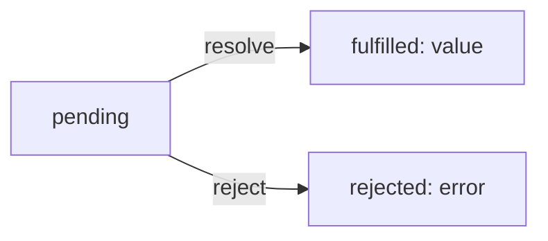
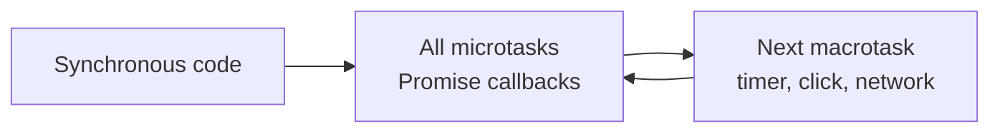

# JavaScript - Asynchronous Programming

JavaScript runs one thing at a time, on a single thread. If it stopped and waited every time it asked a server for data, the page would freeze. So slow work (network requests, timers, reading files) is **asynchronous**: we start it, carry on, and get the result later. Think of ordering at a coffee shop: you order, get a buzzer, and sit down. You don't stand at the counter blocking the queue. This lesson follows the history in order, because each step fixes a problem with the one before: callbacks, then Promises, then `async`/`await`.

## Blocking vs non-blocking

```js
// blocking: nothing else happens until this returns
const results = doLongTask('value')
render(results)

// non-blocking: start it, and say what to do when it's done
doLongTask('value', (results) => render(results))
```

The order things finish in is not the order they're written in. The event loop quiz below shows exactly why.

## Callbacks

A callback is a function we pass to another function, to be called later. This is why so much JavaScript looks like "function inside a function call".

```js
function testMic(sequence, callback) {
  console.log(`Testing ${sequence}`)
  callback()
}

testMic('1 2 3', () => console.log('done'))
// 'Testing 1 2 3'
// 'done'
```

Event listeners are callbacks too. Pass the function, don't call it: no `()`.

```js
function handleClick() {
  console.log('clicked!')
}

button.addEventListener('click', handleClick) // not handleClick()
```

## The trouble with callbacks

When one step depends on the last, callbacks nest deeper and deeper, and every level has to handle its own errors. This is often called "callback hell".

```js
getUser(id, (err, user) => {
  if (err) return showError(err)
  getOrders(user, (err, orders) => {
    if (err) return showError(err)
    getReceipt(orders[0], (err, receipt) => {
      if (err) return showError(err)
      render(receipt)
    })
  })
})
```

The `(err, result)` shape is the "error-first callback" style from Node. You'll still see it in older Node APIs.

## Promises

A Promise is an object standing in for a value that isn't ready yet: the buzzer from the coffee shop. It starts **pending**, then settles once as either **fulfilled** (with a value) or **rejected** (with an error).



`.then()` runs when it's fulfilled, `.catch()` when it's rejected. Each `.then()` returns a new Promise, so steps chain flat instead of nesting.

```js
getUser(id)
  .then((user) => getOrders(user))
  .then((orders) => getReceipt(orders[0]))
  .then((receipt) => render(receipt))
  .catch((error) => showError(error)) // one place for every error
  .finally(() => hideSpinner())       // runs either way
```

## Making a Promise

Most of the time an API hands you a Promise. When you need to wrap something callback-based, use `new Promise` and call `resolve` or `reject`.

```js
function wait(ms) {
  return new Promise((resolve) => setTimeout(resolve, ms))
}

wait(1000).then(() => console.log('one second later'))
```

## The event loop: a quiz 🧠

Before reading on, guess the order these four lines log.

```js
console.log('1: order')
setTimeout(() => console.log('2: timeout'), 0)
Promise.resolve().then(() => console.log('3: promise'))
console.log('4: sit down')
```

Answer: `1`, `4`, `3`, `2`.

Why: JavaScript first runs all the synchronous code to the end, so `1` and `4` come first. Then it empties the **microtask** queue, which is where Promise callbacks wait, so `3`. Only then does it pick the next **macrotask**, such as a timer, so `2`. A `setTimeout` of 0 means "as soon as you're free", not "now", and Promise callbacks always jump ahead of it.



## async and await

`async`/`await` is Promises with nicer syntax. Inside an `async` function, `await` pauses that function until the Promise settles and gives you its value. The code reads top to bottom, like the blocking version, without freezing anything.

```js
async function showReceipt(id) {
  const user = await getUser(id)
  const orders = await getOrders(user)
  const receipt = await getReceipt(orders[0])
  render(receipt)
}
```

An `async` function always returns a Promise, so its caller either `await`s it too or uses `.then()`. In ES modules you can also use `await` at the top level of the file.

## Handling errors with try/catch

A rejected Promise makes `await` throw, so ordinary `try`/`catch` handles it.

```js
async function showReceipt(id) {
  try {
    const user = await getUser(id)
    render(await getReceipt(user))
  } catch (error) {
    showError(error)
  } finally {
    hideSpinner()
  }
}
```

| | `.then()` / `.catch()` | `async` / `await` |
|---|---|---|
| Reads like | a chain | normal top-to-bottom code |
| Errors | `.catch()` | `try` / `catch` |
| Best for | short one-off chains | anything with several steps or conditions |

## Running things at the same time: Promise.all

`await` one after another means each step waits for the last. When tasks don't depend on each other, start them together and wait for all of them.

```js
// slow: about 2 seconds
const coffee = await brew()   // 1s
const toast = await toastIt() // 1s

// fast: about 1 second
const [coffee2, toast2] = await Promise.all([brew(), toastIt()])
```

`Promise.all` rejects as soon as any one fails. When you want every result, failures included, use `Promise.allSettled`. MDN lists the rest of the family (`Promise.race`, `Promise.any`).

## fetch: talking to a server

`fetch` is the built-in way to make HTTP requests, in the browser and in Node. It returns a Promise for a `Response`; reading the body (`.json()`, `.text()`) is a second Promise.

```js
async function loadMenu() {
  const response = await fetch('/api/menu')

  if (!response.ok) {
    throw new Error(`Menu failed to load: ${response.status}`)
  }

  return response.json()
}

const menu = await loadMenu() // e.g. [{ name: 'Latte', price: 3.2 }]
```

To send data, pass options: the method, headers and a body.

```js
await fetch('/api/orders', {
  method: 'POST',
  headers: { 'Content-Type': 'application/json' },
  body: JSON.stringify({ item: 'latte', size: 'large' }),
})
```

## Worked example: don't fetch the same thing twice

Two parts of a page ask for the same menu at the same moment. ❌ Two identical requests. ✅ Keep a `Map` of promises that are still loading: if the key is already there, hand back the pending promise; when it settles, delete the key so the next call fetches fresh data.

```js
const inFlight = new Map()

function getMenu(shopId) {
  if (inFlight.has(shopId)) return inFlight.get(shopId)

  const promise = fetch(`/api/shops/${shopId}/menu`)
    .then((response) => response.json())
    .finally(() => inFlight.delete(shopId))

  inFlight.set(shopId, promise)
  return promise
}

const [menuA, menuB] = await Promise.all([getMenu('corner'), getMenu('corner')])
// one request sent, menuA === menuB // true
```

This works because a Promise can be awaited by any number of callers, and they all get the same result. Deleting the key in `finally` matters: without it, a failed request would be cached forever.

## Before fetch

Before `fetch` we had `XMLHttpRequest` and jQuery's `$.ajax`, both callback-based. The name AJAX (Asynchronous JavaScript and XML) stuck around for "loading data without reloading the page", even though it's almost always JSON now.

## Common mistakes

- **Forgetting `await`**: `const menu = loadMenu()` gives you a pending Promise, not the menu.
- **Assuming `fetch` rejects on a 404 or 500**: it only rejects on network failure. Always check `response.ok`.
- **Awaiting in a loop when tasks are independent**: use `Promise.all` instead.
- **`await` inside `forEach`**: `forEach` doesn't wait. Use `for...of` for one at a time, or `Promise.all` with `map` for all at once.
- **A Promise with no `.catch()` or `try`**: the error disappears into an "unhandled rejection" warning.

## Try it

1. Write `wait(ms)` and use it with `await` to log 'ready' after two seconds.
2. Write `getJSON(url)` with `fetch` that throws a helpful error when `response.ok` is false, and call it inside `try`/`catch`.
3. Fetch two URLs one after another, then with `Promise.all`, and time both with `console.time`.

## Related

- [[docs/javascript/javascript-functions|JavaScript - Functions]]
- [[docs/javascript/javascript-patterns|JavaScript - Common Patterns]]
- [[docs/javascript/javascript-json|JavaScript - JSON]]
- [[docs/node/node-events|Node - Events]]
