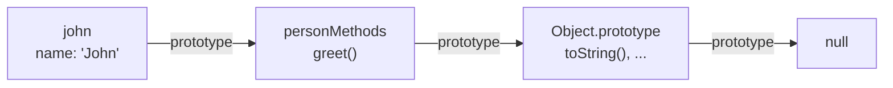

# JavaScript - Classes

A class is a blueprint for making many objects with the same shape: every customer has a name and can place an order. JavaScript's `class` keyword looks like Java or Python, but underneath it runs on **prototypes**. We'll learn the prototype model first, because once it clicks, classes stop being magic and their quirks make sense.

Resource: [Inheritance and the prototype chain (MDN)](https://developer.mozilla.org/en-US/docs/Web/JavaScript/Inheritance_and_the_prototype_chain)

## The problem: many similar objects

Writing each object by hand gets repetitive fast, and each one carries its own copy of every function.

```js
const john = { name: 'John', greet() { return `Hi, I'm ${this.name}.` } }
const chris = { name: 'Chris', greet() { return `Hi, I'm ${this.name}.` } }

john.greet === chris.greet // false: two copies of the same function
```

## Prototypes: objects that fall back on another object

Every object has a hidden link to another object, its prototype. When you ask for a property the object doesn't have, JavaScript follows the link and looks there, then on that object's prototype, and so on. This is the **prototype chain**.

```js
const personMethods = {
  greet() { return `Hi, I'm ${this.name}.` },
}

const john = Object.create(personMethods)
john.name = 'John'

john.greet()                                  // "Hi, I'm John."
Object.hasOwn(john, 'greet')                  // false: it was found on the prototype
Object.getPrototypeOf(john) === personMethods // true
```



One shared `greet`, many objects. That's the whole idea; everything else is syntax on top.

## Constructor functions and `new`

Before classes, we wrote a capitalised function and called it with `new`. `new` creates an empty object, links it to `Person.prototype`, runs the function with `this` set to that object, and returns it.

```js
function Person(name) {
  this.name = name
}

Person.prototype.greet = function () {
  return `Hi, I'm ${this.name}.`
}

const john = new Person('John')
const chris = new Person('Chris')

john.greet()                // "Hi, I'm John."
john.greet === chris.greet // true: shared through the prototype
```

You'll meet this in older code and libraries. You won't need to write it.

## Class syntax

`class` does exactly the same thing with cleaner syntax. `constructor` is the function body; other methods go on the prototype automatically.

```js
class Person {
  constructor(name) {
    this.name = name
  }

  greet() {
    return `Hi, I'm ${this.name}.`
  }
}

const jack = new Person('Jack')
jack.greet() // "Hi, I'm Jack."
typeof Person // 'function': still a constructor underneath
```

Differences from the old way: classes must be called with `new`, they always run in strict mode, and they aren't usable before the line they're declared on.

## Class fields

Fields declare properties at the top of the class, with an optional starting value. They're set on each instance, so every object gets its own.

```js
class Order {
  items = []
  paid = false

  add(item) {
    this.items.push(item)
    return this
  }
}

new Order().add('latte').add('croissant').items // ['latte', 'croissant']
```

Returning `this` from a method is what makes chaining like `.add().add()` work.

## Private fields with `#`

A name starting with `#` is truly private: code outside the class can't read or change it. Before `#`, people used an underscore (`_balance`) as a polite "please don't touch", which nothing enforced.

```js
class CoffeeCard {
  #stamps = 0

  stamp() {
    this.#stamps += 1
    return this.#stamps >= 10 ? 'Free coffee!' : `${this.#stamps}/10`
  }
}

const card = new CoffeeCard()
card.stamp()  // '1/10'
card.#stamps  // SyntaxError: private field
```

That error happens before anything runs: the file won't even load with `card.#stamps` in it.

Methods can be private too: `#format() { ... }`.

## Getters and setters

A getter looks like a property but runs a function. Good for values worked out from other values.

```js
class Person {
  constructor(first, last) {
    this.first = first
    this.last = last
  }

  get fullName() {
    return `${this.first} ${this.last}`
  }
}

new Person('Ana', 'Silva').fullName // 'Ana Silva': no ()
```

## Inheritance with `extends` and `super`

`extends` links one class's prototype to another's. `super(...)` runs the parent constructor and must come before you use `this`. `super.method()` calls the parent's version of a method.

```js
class Teacher extends Person {
  constructor(first, last, subject) {
    super(first, last)
    this.subject = subject
  }

  get fullName() {
    return `${super.fullName}, ${this.subject} teacher`
  }
}

const teresa = new Teacher('Teresa', 'Rodrigues', 'Maths')
teresa.fullName           // 'Teresa Rodrigues, Maths teacher'
teresa instanceof Person // true
```

Keep inheritance chains short. One level is usually plenty; past that, passing objects in (composition) tends to be easier to change.

## Static members

`static` puts a method or field on the class itself rather than on instances. Use it for helpers and factories.

```js
class Temperature {
  static fromFahrenheit(f) {
    return new Temperature((f - 32) * 5 / 9)
  }

  constructor(celsius) {
    this.celsius = celsius
  }
}

Temperature.fromFahrenheit(212).celsius // 100
```

## Common mistakes

- **Forgetting `new`**: `Person('Ana')` with a class throws a TypeError.
- **Using `this` before `super()`** in a child constructor: ReferenceError.
- **Passing a method as a callback**: `button.addEventListener('click', card.stamp)` loses `this`. Use `() => card.stamp()`. See [[docs/javascript/javascript-scope|JavaScript - Scope]].
- **Thinking classes copy methods**: they don't. Change a method on the prototype and every instance sees it.

## Try it

1. Write a `BankAccount` class with a private `#balance`, `deposit(amount)`, `withdraw(amount)` that refuses to go below zero, and a `balance` getter.
2. Make a `SavingsAccount` that extends it and adds `addInterest(rate)`.
3. Build the same `greet` example with `Object.create` and with `class`, then check `Object.getPrototypeOf` on both.

## Related

- [[docs/javascript/javascript-objects|JavaScript - Objects]]
- [[docs/javascript/javascript-scope|JavaScript - Scope]]
- [[docs/javascript/javascript-patterns|JavaScript - Common Patterns]]
- [[docs/javascript/javascript-maps|JavaScript - Maps]]
