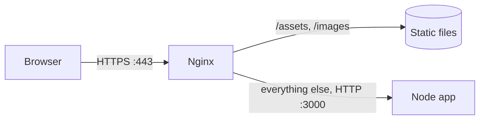

# DevOps - Nginx

Nginx (said "engine-x") is a web server that sits at the front door of your server. It serves static files fast, passes everything else to your app (a **reverse proxy**), and handles HTTPS so your app doesn't have to. A typical setup: Nginx listens on ports `80` and `443`, your Node app listens on `3000` where only Nginx can reach it.



## Install and the commands you'll use

On Ubuntu:

```sh
sudo apt install nginx

sudo nginx -t                    # test the config: always run this first
sudo systemctl reload nginx      # apply changes without dropping connections
sudo systemctl status nginx      # is it running?
```

✓ Habit: `sudo nginx -t && sudo systemctl reload nginx`. If the test fails, nothing reloads and the site stays up.

## Where the config lives

```
/etc/nginx/nginx.conf            main config, rarely touched
/etc/nginx/sites-available/      one file per site
/etc/nginx/sites-enabled/        links to the sites that are switched on
/var/log/nginx/                  access.log and error.log
```

Write a site in `sites-available`, then switch it on with a link:

```sh
sudo nano /etc/nginx/sites-available/coffee
sudo ln -s /etc/nginx/sites-available/coffee /etc/nginx/sites-enabled/
sudo nginx -t && sudo systemctl reload nginx
```

To switch a site off, delete the link. The config stays in `sites-available`.

## How a config is shaped

Blocks inside blocks. Each line ends with a `;`.

```nginx
server {                       # one site
  listen 80;                   # which port
  server_name coffee.example.com;   # which domain

  location / {                 # which paths
    # what to do with them
  }
}
```

Nginx picks the `server` block by port and domain, then the best matching `location` inside it.

## Serving a static site

```nginx
server {
  listen 80;
  server_name coffee.example.com;

  root /var/www/coffee;        # the folder with your built site
  index index.html;

  location / {
    try_files $uri $uri/ =404;
  }
}
```

`try_files` checks each option in order: the exact file, then a folder with an `index.html`, otherwise a `404`.

### Single-page apps

A React app handles its own routes, so `/orders/42` isn't a real file. Fall back to `index.html` and let the app route:

```nginx
location / {
  try_files $uri /index.html;
}
```

## Reverse proxy to your app

Pass requests to an app running on `localhost:3000`:

```nginx
server {
  listen 80;
  server_name api.coffee.example.com;

  location / {
    proxy_pass http://localhost:3000;

    # tell the app who really asked
    proxy_set_header Host $host;
    proxy_set_header X-Real-IP $remote_addr;
    proxy_set_header X-Forwarded-For $proxy_add_x_forwarded_for;
    proxy_set_header X-Forwarded-Proto $scheme;

    # WebSockets
    proxy_http_version 1.1;
    proxy_set_header Upgrade $http_upgrade;
    proxy_set_header Connection "upgrade";
  }
}
```

Without the `X-Forwarded-*` headers every request looks like it came from `127.0.0.1` over plain HTTP, because, to your app, it did. Express needs `app.set('trust proxy', 1)` to read them.

## Redirects: www to non-www

Pick one address and send the other to it with a permanent redirect:

```nginx
server {
  listen 80;
  server_name www.coffee.example.com;
  return 301 $scheme://coffee.example.com$request_uri;
}
```

## HTTPS

Let Certbot do it. It gets a free certificate from Let's Encrypt and edits your config for you:

```sh
sudo certbot --nginx -d coffee.example.com -d www.coffee.example.com
```

What it adds looks roughly like this:

```nginx
server {
  listen 443 ssl;
  http2 on;
  server_name coffee.example.com;

  ssl_certificate     /etc/letsencrypt/live/coffee.example.com/fullchain.pem;
  ssl_certificate_key /etc/letsencrypt/live/coffee.example.com/privkey.pem;

  # ... your locations
}

server {
  listen 80;
  server_name coffee.example.com;
  return 301 https://$host$request_uri;
}
```

Older Nginx versions write `listen 443 ssl http2;` instead of `http2 on;`. Leave TLS settings to Certbot's defaults (TLS 1.2 and 1.3). The long cipher lists from old tutorials allow broken protocols. How certificates work is in [[docs/ssl|Networking - HTTPS and TLS]].

## Common mistakes

- **Reloading without `nginx -t`.** One typo and the whole site is down.
- **Missing `;`** at the end of a line. `nginx -t` tells you the line number.
- **`proxy_pass` typos.** It needs the full `http://localhost:3000`.
- **`502 Bad Gateway`** means Nginx is fine but your app isn't answering. Check the app is running and on the port you think.
- **Permission denied on static files.** The `www-data` user must be able to read the folder. Serving straight from a home folder often fails for this reason.
- **Not reading the logs.** `sudo tail -f /var/log/nginx/error.log` usually says exactly what's wrong.

## Try it

1. Install Nginx on a test server, serve a folder with one `index.html`, and check it with `curl -I`.
2. Run a small Node app on port `3000` and put Nginx in front of it as a reverse proxy. Log `req.headers` in the app and find `x-forwarded-for`.
3. Add a `www` redirect and test it with `curl -I http://www.your-domain`.

## Related

- [[docs/ssl|Networking - HTTPS and TLS]]
- [[docs/dns|Networking - DNS]]
- [[docs/http|Networking - HTTP]]
- [[docs/server-setup|DevOps - Server Setup]]
- [[docs/docker|DevOps - Docker]]
- [[docs/node/node-server|Node - Server]]
