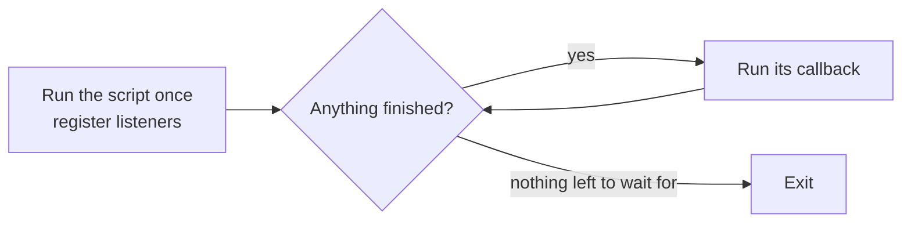

# Node - Events

Node is built around events: "a request arrived", "a chunk of the file is ready", "the server closed". Instead of waiting for things, we say what to do *when* they happen and let Node call us back. This lesson covers the event loop that makes that work, and `EventEmitter`, the small class behind nearly every object in Node that "fires" things.

> JavaScript has certain characteristics that make it very different than other dynamic languages, namely that it has no concept of threads. Its model of concurrency is completely based around events. - Ryan Dahl

## The event loop

When we run a script, Node reads it top to bottom once. Along the way we register interest in events: "when a request comes in, run this". Then, instead of exiting, Node enters the **event loop**: it keeps checking for finished work and runs the matching callback, one at a time.



Think of an inbox. You don't stare at it waiting for each email; you get on with things, and deal with each email as it lands, one at a time.

**Quiz:** what does this print?

```js
setTimeout(() => console.log('timer'), 0)
Promise.resolve().then(() => console.log('promise'))
console.log('script')
```

```
script
promise
timer
```

**Why:** callbacks only run once the current code is done, so `script` always comes first, even with a delay of `0`. Then promise callbacks jump the queue: Node runs them before moving on to timers.

## Why "one at a time" matters

Only one callback runs at any moment. That keeps things simple (no two callbacks fighting over the same variable), but it means a slow callback holds up everyone else.

```js
import http from 'node:http'

http.createServer((req, res) => {
  if (req.url === '/slow') {
    const end = Date.now() + 5000
    while (Date.now() < end) {} // blocks the whole loop for 5 seconds
  }
  res.end('done\n')
}).listen(3000)
```

While `/slow` spins, *every* request waits, even ones to `/`. Waiting for files, databases and the network is fine because Node hands that work off. Heavy number-crunching in a callback is not.

## EventEmitter

Many Node objects emit events: an HTTP server emits `'request'`, a file stream emits `'data'`. They all inherit from `EventEmitter`, and we can use it ourselves.

```js
import { EventEmitter } from 'node:events'

const logger = new EventEmitter()

logger.on('error', (message) => {
  console.log(`ERR: ${message}`)
})

logger.emit('error', 'Spilled milk') // ERR: Spilled milk
```

Two methods do most of the work:

| Method | Does |
|---|---|
| `.on(name, fn)` | listen: run `fn` every time `name` is emitted |
| `.emit(name, ...args)` | fire: call every listener for `name` with `args` |

An object can have many events, and one event can have many listeners. They run in the order they were added.

```js
const chat = new EventEmitter()

chat.on('message', (text) => console.log(`Ana sees: ${text}`))
chat.on('message', (text) => console.log(`Rui sees: ${text}`))

chat.emit('message', 'Coffee?')
// Ana sees: Coffee?
// Rui sees: Coffee?
```

## Once, and removing listeners

```js
chat.once('join', (name) => console.log(`Welcome ${name}`))
chat.emit('join', 'Ana') // Welcome Ana
chat.emit('join', 'Rui') // nothing, the listener is gone

const shout = (text) => console.log(text.toUpperCase())
chat.on('message', shout)
chat.off('message', shout) // stop listening
```

To wait for one event with `await`, use `once` from `node:events`:

```js
import { once } from 'node:events'

const [name] = await once(chat, 'join')
```

## Making your own emitter class

Extend `EventEmitter` and your objects can fire their own events.

```js
import { EventEmitter } from 'node:events'

class CoffeeOrder extends EventEmitter {
  brew() {
    this.emit('brewing')
    setTimeout(() => this.emit('ready', 'flat white'), 1000)
  }
}

const order = new CoffeeOrder()
order.on('brewing', () => console.log('Brewing...'))
order.on('ready', (drink) => console.log(`Your ${drink} is ready`))
order.brew()
// Brewing...
// Your flat white is ready   (a second later)
```

## Decoding http.createServer

Now `http.createServer` makes sense. The server is an `EventEmitter`, and the function we pass in is simply added as a listener for its `'request'` event. These two are the same:

```js
import http from 'node:http'

http.createServer((req, res) => res.end('Hi\n'))

const server = http.createServer()
server.on('request', (req, res) => res.end('Hi\n'))
server.on('close', () => console.log('server closed'))
```

## Common mistakes

- **Not listening for `'error'`.** If an emitter emits `'error'` and nobody is listening, Node throws and the process crashes. Always add an error listener to streams, sockets and servers.
- **Emitting before anyone listens.** Events aren't stored. Register listeners first, then emit.
- **Blocking the loop.** A long synchronous loop freezes every callback, including other users' requests.
- **Adding a listener inside a function that runs often.** Each call adds another one. Node warns about a possible memory leak when the count gets high.

## Try it

1. Add a `setImmediate(() => console.log('immediate'))` to the quiz above. Run it a few times. Is its order against `timer` always the same? (Look up why in the Node docs on the event loop.)
2. Build a `Timer` class that extends `EventEmitter` and emits `'tick'` every second and `'done'` after five ticks.
3. Use `once()` from `node:events` to `await` the `'done'` event.

## Related
- [[docs/node/node|Node - Basics]]
- [[docs/node/node-streams|Node - Streams]]
- [[docs/node/node-http|Node - HTTP]]
- [[docs/javascript/javascript-async|JavaScript - Asynchronous Programming]]
- [[docs/javascript/javascript-patterns|JavaScript - Common Patterns]]
