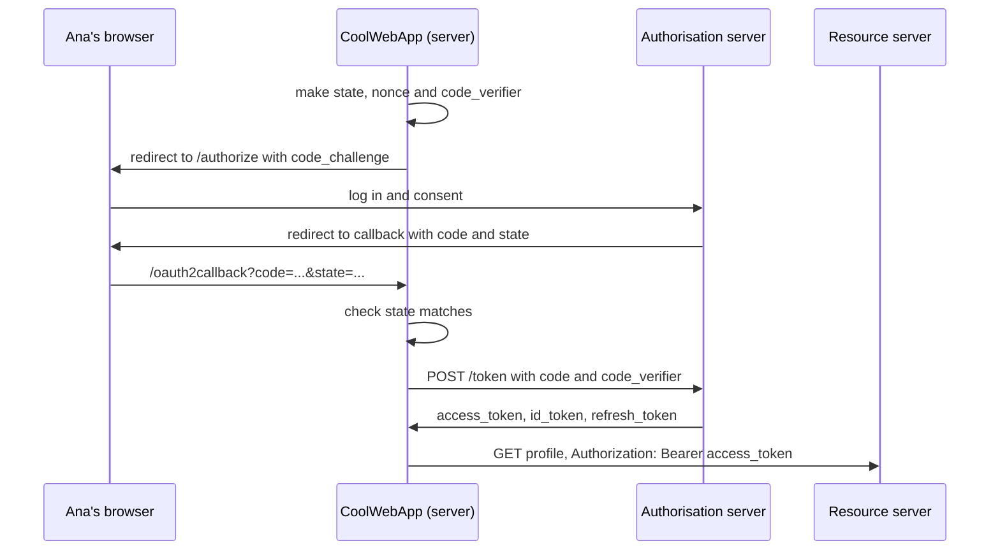

# Security - OAuth 2 and OpenID Connect

OAuth 2 lets a user give your app access to their stuff on another service without handing over their password. "Sign in with Google", "Connect your calendar", "Let this app post to GitHub": all OAuth. **OpenID Connect** (OIDC) is a thin layer on top that also tells your app **who** the user is. Most of the time you'll use a library or an auth provider, but you need the flow in your head to set it up safely and debug it.

## OAuth 2 vs OpenID Connect

| | OAuth 2 | OpenID Connect |
|---|---|---|
| Answers | What can this app do? (authorisation) | Who is this user? (authentication) |
| You get | An `access_token` | An `access_token` **and** an `id_token` |
| Turn it on with | Scopes like `calendar.read` | The `openid` scope (plus `profile`, `email`) |
| Use it for | Calling the user's APIs | "Sign in with..." |

OAuth on its own was never meant for login. Apps used to take an access token and treat it as proof of identity, but a token issued to a malicious app could then be replayed against yours to impersonate the user. OIDC fixes that with the `id_token`: a signed [[docs/jwt|JWT]] made for **your** app only.

## The four players

- **User** (resource owner): Ana, who owns the Google account.
- **Client**: your app, CoolWebApp.
- **Authorisation server**: the login and consent screen, e.g. Google's accounts server.
- **Resource server**: the API with Ana's data, e.g. Google's profile or calendar API.

## Before you start

Register your app with the provider. You get a client id, a client secret (for server apps) and you choose a redirect URI. Keep them in environment variables:

```
GOOGLE_CLIENT_ID=123456789.apps.googleusercontent.com
GOOGLE_CLIENT_SECRET=a1B2c3D4E5f6g7h8
GOOGLE_CLIENT_REDIRECT_URI=https://coolwebapp.example/oauth2callback
```

The client secret never goes to the browser or into a mobile app.

## The authorisation code flow with PKCE

✓ This is the flow to use for everything today: server apps, single-page apps and mobile apps. The older **implicit flow** (tokens straight in the URL) is no longer recommended.

```
Ana - Hey App, can I use you?
App - Sure, but I need your Google profile.
Ana - I'm not giving you my Google password...
App - You don't have to. Go and tell Google I'm allowed, and they'll give me a code.
```

![[oauth2-code-flow.svg]]



### 1. Make the secrets for this login

Your server creates three random values and remembers them for this login (in the session):

- `state`: protects against CSRF. You'll check it comes back unchanged.
- `nonce`: goes into the `id_token`, so an old token can't be replayed.
- `code_verifier`: the PKCE secret. You send its SHA-256 hash now (`code_challenge`) and the verifier itself later.

```ts
import { randomBytes, createHash } from 'node:crypto'

const codeVerifier = randomBytes(32).toString('base64url')
const codeChallenge = createHash('sha256').update(codeVerifier).digest('base64url')
```

PKCE (Proof Key for Code Exchange, said "pixy") means that even if someone steals the code from the redirect, they can't swap it for tokens without the verifier.

### 2. Send the user to the authorisation server

```sh
https://auth.example.com/authorize?
  # it's CoolWebApp
  client_id=GOOGLE_CLIENT_ID&
  # I want an authorisation code back
  response_type=code&
  # what I need: OpenID login, profile and email
  scope=openid profile email&
  # where to send Ana when she agrees
  redirect_uri=GOOGLE_CLIENT_REDIRECT_URI&
  # give me this back so I know the reply is for me
  state=i9j10K11l12M13&
  nonce=n0Nc3&
  # PKCE
  code_challenge=CODE_CHALLENGE&
  code_challenge_method=S256
```

Ana logs in **on the provider's site** and agrees to share her profile. Your app never sees her password.

```
Ana - Hey Google, give CoolWebApp what it asked for.
Google - Sure, Ana. Just confirm on this consent screen.
```

### 3. The provider redirects back with a code

```
https://coolwebapp.example/oauth2callback?code=n14O15p16q17r18&state=i9j10K11l12M13
```

First thing: check `state` matches the one you saved. If it doesn't, stop.

The code is short-lived and single-use. On its own it's worthless.

### 4. Swap the code for tokens

Your server calls the token endpoint directly, not through the browser:

```sh
POST https://auth.example.com/token
Content-Type: application/x-www-form-urlencoded

grant_type=authorization_code&
code=n14O15p16q17r18&
redirect_uri=GOOGLE_CLIENT_REDIRECT_URI&
client_id=GOOGLE_CLIENT_ID&
# server apps: proves it's really us
client_secret=GOOGLE_CLIENT_SECRET&
# PKCE: proves we started this login
code_verifier=CODE_VERIFIER
```

A public client (an SPA or mobile app) sends no secret: PKCE does that job.

### 5. Read the tokens

```ts
{
  token_type: 'Bearer',
  // use it to call the user's APIs
  access_token: 's19T20u21v22w23...',
  // who the user is (OpenID Connect)
  id_token: 'x24Y25z26a1B2...',
  // only if you asked for offline access: get new access tokens later
  refresh_token: 'C3d4E5f6g7...',
  expires_in: 3600,
}
```

The decoded `id_token`:

```json
{
  "iss": "https://accounts.google.com",
  "aud": "GOOGLE_CLIENT_ID",
  "sub": "USER_ID",
  "email": "ana@example.com",
  "email_verified": true,
  "nonce": "n0Nc3",
  "iat": 1466026137,
  "exp": 1466029737
}
```

Before you trust it, verify: the signature (with the provider's public keys), `iss` is the provider, `aud` is **your** client id, `exp` hasn't passed and `nonce` matches.

Identify the user by `iss` + `sub`, not by email. Emails change; `sub` doesn't.

### 6. Log the user in to your app

Now you know who Ana is. Find or create her user record, then start **your own** session or token. The provider's tokens are for calling the provider's APIs; your app's login is yours.

```
Server - We know who Ana is now. Here's your session cookie.
App - Great, welcome in, Ana. 🎉
```

## Refresh tokens

Access tokens are short-lived. To keep working while Ana is away, ask for offline access (the `offline_access` scope in OIDC; some providers use their own parameter, Google uses `access_type=offline`) and store the `refresh_token` safely on the server. Swap it at the token endpoint for a new access token when the old one expires.

## Common mistakes

- **Skipping the `state` check.** It's what stops an attacker logging Ana into **their** account.
- **Using the access token as proof of identity.** That's what the `id_token` is for.
- **Not checking `aud` on the `id_token`.** A token issued to another app would be accepted by yours.
- **Client secret in the frontend.** Anything in a browser bundle or mobile app is public. Use PKCE.
- **Loose redirect URIs.** Register exact URLs. Wildcards let an attacker redirect codes to themselves.
- **Asking for every scope up front.** Ask for the least you need; users say no to scary consent screens.

## Try it

1. Draw the flow from memory with the four players. Mark where `state`, `nonce` and `code_verifier` are created and checked.
2. Generate a `code_verifier` and `code_challenge` with the snippet above, and explain why sending only the hash first helps.
3. Decode an `id_token` from a provider you use. Which claims would you use to identify the user?

## Related

- [[docs/jwt|Security - JWT]]
- [[docs/security|Security - Basics]]
- [[docs/cryptography|Security - Cryptography]]
- [[docs/http|Networking - HTTP]]
