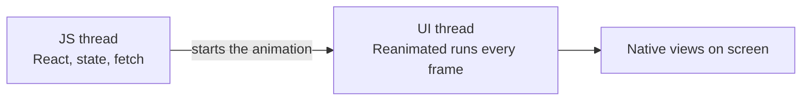

# React Native - Animation

Animation is what makes an app feel native: a sheet that follows your finger, a button that springs back. In React Native you do it with **Reanimated**, which runs your animation code on the UI thread, so it stays smooth at 60fps even while your JavaScript is busy loading the menu. Add **gesture-handler** for touch and **Skia** for custom drawing, and you can build almost anything a designer can sketch.

## Why the UI thread

A React Native app has (at least) two threads that matter:

- **JS thread**: runs your React code, state, fetches and re-renders.
- **UI thread**: draws the native views, about every 16ms for 60fps.

If an animation lives in React state, every frame goes JS → re-render → UI. The moment the JS thread is busy (parsing a big response, rendering a list), frames get dropped and the animation stutters. Reanimated moves the animation to the UI thread, so a busy JS thread can't touch it.



Functions that run on the UI thread are called **worklets**. Reanimated turns the callbacks you pass it into worklets for you.

## Shared values

A shared value is a box that both threads can read. Changing it does **not** re-render the component: it only updates what's animated.

```tsx
import { useSharedValue } from 'react-native-reanimated'

const scale = useSharedValue(1)
scale.value = 1.2 // the view updates, React doesn't re-render
```

Think of it as `useRef` for animations: a value that changes without React caring.

## useAnimatedStyle

`useAnimatedStyle` maps shared values to a style. Put the result on an `Animated` component.

```tsx
import Animated, { useAnimatedStyle, useSharedValue } from 'react-native-reanimated'

function Cup() {
  const scale = useSharedValue(1)
  const style = useAnimatedStyle(() => ({
    transform: [{ scale: scale.value }],
  }))

  return <Animated.View style={[styles.cup, style]} />
}
```

`Animated.View`, `Animated.Text` and friends are the animatable versions of the core components. You can mix a normal style and an animated one in the same array.

## withTiming vs withSpring

You rarely set a value directly: you set it **to an animation**.

```tsx
scale.value = withTiming(1.2, { duration: 300 }) // fixed time, eased curve
scale.value = withSpring(1.2)                    // physics: no duration, it settles
```

| | `withTiming` | `withSpring` |
|---|---|---|
| Feels like | A fade, a slide | Something physical |
| Controlled by | `duration`, `easing` | `stiffness`, `damping`, `mass` |
| Interrupted mid-way | Restarts the curve | ✅ Keeps its velocity, feels natural |
| Use for | Opacity, colour | Anything the user moves |

Springs are the ones to learn well: high stiffness is snappy, low damping is wobbly. To make items follow each other in a stagger, delay each one a little more: `withDelay(index * 50, withSpring(1))`.

Colours animate too. Keep a `0` to `1` progress value and interpolate between two theme colours:

```tsx
const active = useSharedValue(0)
const style = useAnimatedStyle(() => ({
  backgroundColor: interpolateColor(active.value, [0, 1], [colors.surface, colors.primary]),
}))

const toggle = () => {
  active.value = withTiming(active.value === 0 ? 1 : 0, { duration: 500 })
}
// tap → the card fades from surface to primary in half a second
```

This is how I animate themed colours: the theme gives the two ends, the shared value moves between them.

For simple state changes (a width that changes, a fade on mount), Reanimated 4 also supports CSS-style transitions and animations as style props, with no shared values at all.

## Gestures

`react-native-gesture-handler` recognises touches on the UI thread too, so a drag can update a shared value without going through JS. Wrap the app once in `GestureHandlerRootView`.

```tsx
import { Gesture, GestureDetector } from 'react-native-gesture-handler'

function DraggableCard() {
  const x = useSharedValue(0)

  const pan = Gesture.Pan()
    .onUpdate((event) => {
      x.value = event.translationX // follows your finger
    })
    .onEnd(() => {
      x.value = withSpring(0) // springs back on release
    })

  const style = useAnimatedStyle(() => ({ transform: [{ translateX: x.value }] }))

  return (
    <GestureDetector gesture={pan}>
      <Animated.View style={[styles.card, style]} />
    </GestureDetector>
  )
}
```

That's the whole pattern for swipe-to-dismiss, bottom sheets and carousels: gesture writes a shared value, animated style reads it, a spring finishes the job.

## Skia for drawing

Sometimes views aren't enough: a progress ring, a chart, a blurred glow, a shader. React Native Skia gives you a `<Canvas>` and drawing primitives, rendered by Skia, the 2D graphics engine behind Chrome. It accepts shared values directly, so Reanimated drives it.

```tsx
import { Canvas, Circle } from '@shopify/react-native-skia'

<Canvas style={{ width: 120, height: 120 }}>
  <Circle cx={60} cy={60} r={radius} color="#6b3e26" />
</Canvas>
// radius can be a shared value: the circle grows on the UI thread
```

Reach for Skia when you're drawing, not for laying out normal UI.

## Common mistakes

- **Animating with `useState`.** Every frame re-renders through JS. Use a shared value.
- **Reading `.value` during render.** Shared values are for worklets and event handlers. Reading one in the component body gives you a stale snapshot and doesn't update. If you use the React Compiler, prefer the `get()` / `set()` methods.
- **Forgetting `Animated.View`.** An animated style on a plain `View` does nothing.
- **Heavy work in a worklet.** It runs every frame on the UI thread. Keep it to maths.
- **Judging smoothness in dev mode.** Dev builds are slower. Check animations in a release build on a real Android phone.

## Try it

1. Make a button that scales to `0.95` with `withSpring` while pressed and back to `1` on release.
2. Build a card you can drag sideways that springs back to the centre when you let go.
3. Show three menu items that fade and slide in one after another with `withDelay`.

## Related
- [[docs/react-native/react-native|React Native - Basics]]
- [[docs/react-native/react-native-performance|React Native - Performance]]
- [[docs/react-native/react-native-styling|React Native - Styling and Themes]]
- [[docs/css/css-animations|CSS - Animations]]
- [[docs/react/react|React - Basics]]
- [[docs/typescript/typescript|TypeScript - Basics]]
