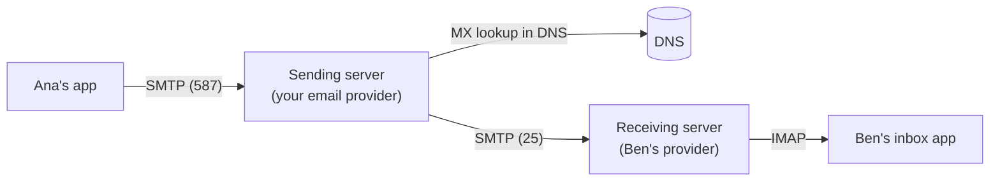

# Networking - Email

Email is one of the oldest protocols still in daily use, and it's still how your app sends password resets, receipts and invites. You'll rarely run a mail server yourself, but you will set up DNS records so your emails land in the inbox and not in spam. To do that well you need the mental model: how a message travels, and how the receiving server decides whether to trust it.

## How a message travels

Think of it like posting a letter. You hand it to your local post office, they pass it to the recipient's post office, and the recipient picks it up from there.



1. Your app **submits** the message to a sending server, usually on port `587`.
2. The sending server looks up the recipient domain's `MX` record in [[docs/dns|DNS]] to find their mail server.
3. It **relays** the message to that server over SMTP, on port `25`.
4. The recipient reads it with an app that speaks **IMAP** (or the provider's own web app).

| Protocol | Job |
|---|---|
| SMTP | Sending and relaying mail between servers |
| IMAP | Reading mail that stays on the server, synced across devices |
| POP3 | Downloading mail to one device. Mostly replaced by IMAP |

## An SMTP conversation

SMTP is plain text, like HTTP. Here's Ana's server delivering a message to Ben's (`S:` is the receiving server, `C:` the sender):

```
S: 220 mail.ben.example ESMTP ready
C: EHLO mail.ana.example
S: 250 Hello
C: MAIL FROM:<ana@ana.example>
S: 250 OK
C: RCPT TO:<ben@ben.example>
S: 250 OK
C: DATA
S: 354 End data with <CR><LF>.<CR><LF>
C: From: Ana <ana@ana.example>
C: To: Ben <ben@ben.example>
C: Subject: Coffee?
C:
C: Flat white at 10?
C: .
S: 250 Queued
C: QUIT
S: 221 Bye
```

Like HTTP status codes, `2xx` means fine, `4xx` means "try again later" and `5xx` means "no".

## Envelope vs headers

Notice the address appears twice. `MAIL FROM` and `RCPT TO` are the **envelope**: what the servers use to deliver it. The `From:` and `To:` lines inside `DATA` are the **headers**: what the reader's app shows.

They don't have to match, which is exactly how spoofing works: anyone can write `From: bank@yourbank.example` in the headers. The next three records exist to catch that.

## SPF, DKIM and DMARC

All three are `TXT` records in your DNS. Together they let a receiving server answer "did this really come from this domain?"

| | Question it answers | How |
|---|---|---|
| SPF | Is this server allowed to send for the domain? | A list of allowed senders |
| DKIM | Was the message changed, and did the domain sign it? | A cryptographic signature in the headers |
| DMARC | What should I do if SPF and DKIM fail? | A policy, plus where to send reports |

### SPF

Lists which servers may send mail for your domain. Your email provider tells you what to put in it.

```
example.com.  TXT  "v=spf1 include:spf.mailprovider.example -all"
# only the provider's servers may send; reject everything else
```

### DKIM

The sending server signs each message with a private key. You publish the matching public key in DNS, under a **selector** your provider gives you. The receiver checks the signature, so it knows the message came from your domain and wasn't changed on the way. It's the same idea as the signatures in [[docs/cryptography|Security - Cryptography]].

```
selector1._domainkey.example.com.  TXT  "v=DKIM1; k=rsa; p=MIIBIjANBgkq..."
```

### DMARC

Ties the two together and tells receivers what to do when a message fails: nothing (`none`), spam folder (`quarantine`) or bounce (`reject`). It also asks for reports, so you can see who is sending as your domain.

```
_dmarc.example.com.  TXT  "v=DMARC1; p=quarantine; rua=mailto:dmarc@example.com"
```

Start with `p=none`, read the reports for a couple of weeks, then tighten to `quarantine` or `reject`. Big inbox providers now expect all three for anyone sending in bulk.

## Should you run your own mail server?

❌ No. Running Postfix on a server is a great way to learn SMTP and a bad way to deliver mail.

- New server IPs have no reputation, so your mail goes to spam.
- Many cloud providers block or limit outbound port `25` by default.
- You need a matching `PTR` record, SPF, DKIM, DMARC, spam filtering and constant monitoring.

✓ Use a transactional email service for app mail (password resets, receipts) and a hosted provider for your own inbox. If all you want is `hello@yourdomain` landing in your existing inbox, most registrars and DNS providers offer free email forwarding.

## Sending from your app

Your app either talks SMTP to the provider on port `587`, or calls the provider's HTTP API. Either way the provider handles delivery, retries and bounces.

## Common mistakes

- **Two SPF records.** A domain can have only one. Merge the `include:`s into a single record.
- **Jumping straight to `p=reject`.** You'll bounce your own newsletters. Start at `none`.
- **Sending from a domain you haven't set up.** No SPF or DKIM for it means spam folder at best.
- **Forwarding breaks SPF.** A forwarded message arrives from the forwarder's server, not yours. DKIM survives if the message isn't changed, which is one more reason to set it up.

## Try it

1. Run `dig example.com MX` and `dig _dmarc.example.com TXT` for your own domain or your employer's. What policy do they use?
2. Open "Show original" (or "View source") on an email in your inbox and find the `SPF`, `DKIM` and `DMARC` results in the headers.
3. Write the three `TXT` records for a new domain that sends mail through one provider.

## Related

- [[docs/dns|Networking - DNS]]
- [[docs/networking|Networking - Basics]]
- [[docs/ssl|Networking - HTTPS and TLS]]
