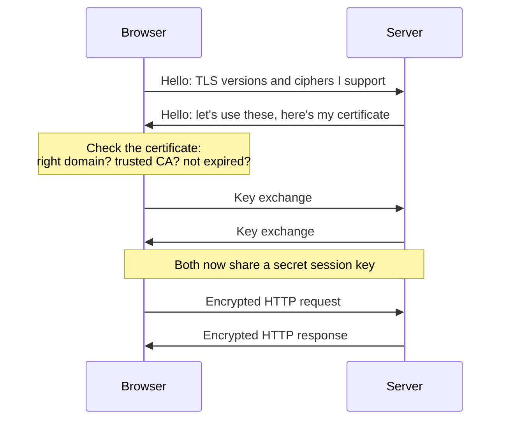

# Networking - HTTPS and TLS

HTTPS is plain [[docs/http|HTTP]] sent through an encrypted tunnel called **TLS** (Transport Layer Security). Without it, anyone on the same café Wi-Fi can read and change what you send: passwords, cookies, the page itself. Today every site should be HTTPS: browsers flag plain HTTP as "Not secure", and certificates are free.

## SSL vs TLS

**SSL** was the original protocol. It was replaced by TLS long ago, and every version of SSL is broken. People still say "SSL certificate" out of habit, but what you're actually running is TLS.

| Version | Use it? |
|---|---|
| SSL 2.0, SSL 3.0 | ❌ Broken |
| TLS 1.0, TLS 1.1 | ❌ Deprecated |
| TLS 1.2 | ✅ Fine |
| TLS 1.3 | ✅ Best: faster and simpler |

## What TLS gives you

Three promises, all at once:

- **Encryption**: nobody in the middle can read the traffic.
- **Integrity**: nobody can change it without being noticed.
- **Authentication**: you're really talking to `example.com`, not an impostor.

Encryption without authentication is useless. You'd have a perfectly private conversation with the wrong person. That's what certificates are for.

## Certificates

A **certificate** is a small file that says "this public key belongs to `example.com`", signed by a **Certificate Authority** (CA) that browsers trust. It holds:

- The domain names it covers (`example.com`, `www.example.com`).
- The site's **public key**.
- Who issued it, and the CA's signature.
- When it expires.

The server keeps the matching **private key** secret. If you're fuzzy on public and private keys, read [[docs/cryptography|Security - Cryptography]] first.

### Chain of trust

Your browser doesn't know every certificate. It knows a short list of **root CAs** built into the operating system or browser. A root signs an **intermediate**, and the intermediate signs your site's certificate.

```
Root CA (built into your OS)
 └ Intermediate CA
    └ example.com   ← the certificate your server sends
```

Your server must send its certificate **and** the intermediate (the "full chain"). Forget the intermediate and some clients will refuse to connect.

## The handshake, simplified

Before any HTTP is sent, client and server agree how to talk:



This is **hybrid encryption**: slow public-key crypto is used once to agree on a shared key, then fast symmetric encryption carries the data. Modern key exchanges also give **forward secrecy**: if the server's private key leaks later, old recorded traffic still can't be decrypted.

## Let's Encrypt and Certbot

[Let's Encrypt](https://letsencrypt.org/) is a free, automated CA. Its certificates are short-lived, so renewal **must** be automatic. That's the point: a cron job never forgets.

To get a certificate, you prove you control the domain with a **challenge**:

| Challenge | How you prove it | Use when |
|---|---|---|
| HTTP-01 | Serve a file on port 80 | ✅ The usual case: a server with a public IP |
| DNS-01 | Add a `TXT` record | Wildcards (`*.example.com`) or no public server |

On an Ubuntu server with [[docs/nginx|Nginx]], Certbot does it all: gets the certificate, edits your Nginx config and sets up renewal.

```sh
sudo apt install certbot python3-certbot-nginx
sudo certbot --nginx -d example.com -d www.example.com

# check that automatic renewal works
sudo certbot renew --dry-run
```

✓ If you deploy to a platform (Vercel, Netlify, a managed load balancer), you get HTTPS without touching any of this. Same for a CDN in front of your server.

## Checking a certificate

```sh
# quick look: does HTTPS work, which TLS version?
curl -vI https://example.com 2>&1 | grep -E 'SSL connection|expire'

# the full certificate details
openssl s_client -connect example.com:443 -servername example.com </dev/null \
  | openssl x509 -noout -subject -issuer -dates
# subject=CN = example.com
# issuer=...
# notBefore=...
# notAfter=...
```

## HSTS

Even with HTTPS, a user typing `example.com` first hits plain HTTP before your redirect. **HSTS** (HTTP Strict Transport Security) is a response header that tells the browser "only ever use HTTPS for this site from now on":

```
Strict-Transport-Security: max-age=31536000; includeSubDomains
```

Add it once HTTPS works everywhere on the domain. It's hard to undo, because browsers remember it.

## Common mistakes

- **Missing intermediate.** Works in your browser (it cached the intermediate), fails in `curl` or on phones. Serve `fullchain.pem`, not just `cert.pem`.
- **Renewal never tested.** Run `certbot renew --dry-run` after setup, not three months later when the site is down.
- **Mixed content.** An HTTPS page loading `http://` images or scripts. Browsers block or warn. Use `https://` or relative URLs.
- **Self-signed certificates in production.** Fine for local experiments, but every visitor gets a scary warning, and training people to click through warnings is worse than no HTTPS.
- **Committing the private key.** It goes on the server only, readable by root.

## Try it

1. Click the padlock on a site you use and find the issuer, the expiry date and the chain.
2. Run the `openssl s_client` command above against two sites and compare who issued their certificates.
3. On a test server with a domain, install Nginx and get a Let's Encrypt certificate with Certbot. Then check it with `curl -vI`.

## Related

- [[docs/cryptography|Security - Cryptography]]
- [[docs/http|Networking - HTTP]]
- [[docs/dns|Networking - DNS]]
- [[docs/nginx|DevOps - Nginx]]
- [[docs/server-setup|DevOps - Server Setup]]
- [[docs/security|Security - Basics]]
